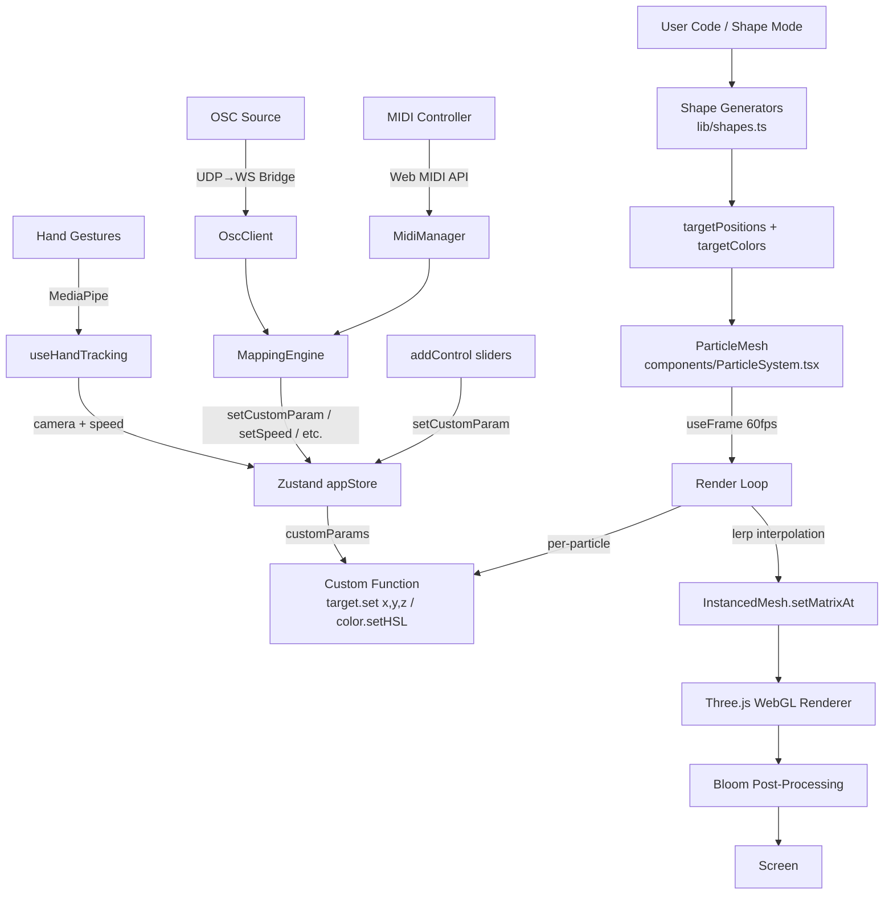

# particle-architect — Architecture Guide

## Overview

particle-architect is a WebGL particle simulation engine rendering 20,000–50,000 particles at 60fps. Users write JavaScript functions that control per-particle position and color each frame. The app is built with **React 18 + Zustand + Three.js InstancedMesh**, deployed on **Cloudflare Pages** with a **D1 (SQLite)** backend for community formations.

## Directory Tree

```
particle-architect/
├── docs/                          # Documentation (you are here)
│   ├── ARCHITECTURE.md
│   ├── MIDI_OSC_INTEGRATION.md
│   └── LIVE_PERFORMANCE_GUIDE.md
├── functions/                     # Cloudflare Pages Functions (server-side)
│   ├── api/
│   │   ├── formations.ts          # GET /api/formations — list formations
│   │   ├── formations/
│   │   │   ├── [[id]].ts          # GET/DELETE /api/formations/:id
│   │   │   └── check.ts           # GET /api/formations/check?name=...
│   │   └── env.d.ts               # Cloudflare env type declarations
│   └── tsconfig.json
├── migrations/
│   └── 0001_initial.sql           # D1 schema: formations table
├── public/
│   ├── music/                     # Background music tracks (mp3)
│   └── *.png, *.ico, *.svg        # PWA icons and favicons
├── src/
│   ├── App.tsx                    # Root component — orchestrates all modes
│   ├── main.tsx                   # React DOM entry point
│   ├── index.css                  # Tailwind directives + custom theme vars
│   ├── components/
│   │   ├── ParticleSystem.tsx     # Three.js Canvas + InstancedMesh render loop
│   │   ├── Sidebar.tsx            # Left panel: shapes, create, import, library
│   │   ├── Toolbar.tsx            # Top-right control buttons
│   │   ├── HUD.tsx                # Info panel + ControlsPanel + AnnotationLayer
│   │   ├── SettingsModal.tsx      # Settings tabs (General/Controls/Display/Neural Nav/MIDI-OSC)
│   │   ├── MidiOscPanel.tsx       # MIDI/OSC connection, mappings, and monitor UI
│   │   ├── GestureOverlay.tsx     # MediaPipe hand tracking canvas overlay
│   │   ├── DrawingPad.tsx         # Canvas drawing → particle formation
│   │   ├── GuideModal.tsx         # AI prompt template / API docs
│   │   ├── ExportModal.tsx        # Export to Vanilla/React/Three.js
│   │   └── AlertModal.tsx         # Toast notifications
│   ├── hooks/
│   │   ├── useHandTracking.ts     # MediaPipe hand gesture → camera/speed control
│   │   ├── useCameraCheck.ts      # Camera availability detection
│   │   └── useMidiOsc.ts          # MIDI + OSC input → mapping engine → params
│   ├── stores/
│   │   └── appStore.ts            # Zustand stores (app, music, export, alert)
│   ├── midi/
│   │   └── MidiManager.ts         # Web MIDI API wrapper (singleton)
│   ├── osc/
│   │   ├── OscClient.ts           # WebSocket client for OSC bridge (singleton)
│   │   └── osc-bridge-server.js   # Standalone Node.js: UDP OSC → WebSocket
│   ├── mappings/
│   │   ├── MappingEngine.ts       # Source → target mapping with scaling/curves
│   │   └── MappingStore.ts        # Zustand store for mapping configuration
│   ├── lib/
│   │   ├── shapes.ts              # Shape generators (sphere, cube, text, model, etc.)
│   │   ├── materials.ts           # 8 render styles (spark, plasma, ink, etc.) with shaders
│   │   ├── validation.ts          # User code sandbox (forbidden keywords + dry-run)
│   │   ├── api.ts                 # REST client for Cloudflare D1 backend
│   │   ├── exportTemplates.ts     # Code generation for Vanilla/React/Three.js export
│   │   └── utils.ts               # cn() helper (clsx + tailwind-merge)
│   └── types/
│       └── index.ts               # TypeScript interfaces and type aliases
├── index.html                     # PWA shell
├── package.json
├── vite.config.ts                 # Vite + PWA plugin, chunk splitting
├── tailwind.config.js
├── tsconfig.json
└── wrangler.toml                  # Cloudflare Pages + D1 config
```

## Data Flow



## Core Systems

### 1. Particle Render Loop

**File:** `src/components/ParticleSystem.tsx`

The render loop runs at 60fps inside `useFrame()`. For each frame:

1. Iterate over all particles (up to 20,000)
2. If a custom function exists, call it with `(i, count, target, color, THREE, time, setInfo, annotate, addControl)`
3. The custom function writes to `target` (Vector3) and `color` (Color)
4. Positions are interpolated with `lerp(current, target, 0.08)` for smooth transitions
5. A `dummy.position.copy(pos)` → `dummy.updateMatrix()` → `instancedMesh.setMatrixAt(i, matrix)` pipeline updates the GPU buffer
6. `instancedMesh.instanceMatrix.needsUpdate = true` triggers the GPU upload

### 2. User Code Execution

**Files:** `src/App.tsx` (compilation), `src/lib/validation.ts` (sandboxing)

User-written JavaScript is compiled via `new Function(...)` with these parameters:
- `i` — particle index (0 to count-1)
- `count` — total particle count
- `target` — `THREE.Vector3` to set position
- `color` — `THREE.Color` to set colour
- `THREE` — Three.js library
- `time` — simulation time (seconds, affected by speed)
- `setInfo(title, desc)` — set HUD info
- `annotate(id, x, y, z, label, visible)` — place 3D labels
- `addControl(id, label, min, max, initial)` → returns current value

**Security sandbox:** `validation.ts` blocks forbidden keywords (document, window, fetch, eval, WebSocket, navigator, localStorage, setTimeout, etc.) and performs a dry-run execution with mock objects before allowing the code to run in the real render loop.

### 3. addControl() System

**File:** `src/stores/appStore.ts`

```typescript
addControl(id, label, min, max, initial) → number
```

- First call: registers the control, stores initial value, adds to `controlKeys[]`
- Subsequent calls: returns `customParams[id]` (the current slider value)
- UI renders sliders in `ControlsPanel` (HUD.tsx) and Settings → Controls tab
- `setCustomParam(id, value)` updates the value from any source (slider, MIDI, OSC)

**Key insight:** The custom function doesn't know whether a value came from a UI slider, MIDI CC, or OSC message. This is what makes the MIDI/OSC integration seamless.

### 4. State Management

**File:** `src/stores/appStore.ts`

Four Zustand stores:

| Store | Purpose | Persisted |
|-------|---------|-----------|
| `useAppStore` | Simulation state, display, controls, custom params | Yes (partial) |
| `useMusicStore` | Background music player | No |
| `useExportStore` | Export modal state | No |
| `useAlertStore` | Toast notification state | No |

**appStore key slices:**

```typescript
{
  // Simulation
  mode: ShapeMode,           // 'sphere' | 'cube' | 'text' | 'custom' | ...
  renderStyle: RenderStyle,  // 'spark' | 'plasma' | 'ink' | ...
  speed: number,             // 0.1 - 3.0
  simTime: number,           // accumulated simulation time
  autoSpin: boolean,
  bloomStrength: number,     // 0.5 - 3.0

  // Custom code
  activeCustomCode: string | null,
  customParams: Record<string, number>,
  controlKeys: string[],

  // Input
  handControlEnabled: boolean,
  midiOscEnabled: boolean,
}
```

**Persisted fields:** `customShapes`, `speed`, `autoSpin`, `bloomStrength`, `showHUD`, `showAnnotations`, `sidebarCollapsed`, `videoVolume`, `renderStyle`, `midiOscEnabled`.

Additionally, `useMappingStore` (in `src/mappings/MappingStore.ts`) persists MIDI/OSC mapping configuration.

### 5. MIDI/OSC Input System

**Files:** `src/midi/MidiManager.ts`, `src/osc/OscClient.ts`, `src/mappings/MappingEngine.ts`, `src/mappings/MappingStore.ts`, `src/hooks/useMidiOsc.ts`

See [MIDI_OSC_INTEGRATION.md](./MIDI_OSC_INTEGRATION.md) for full details.

The flow:
1. `MidiManager` (singleton) wraps Web MIDI API, parses messages, normalises values to 0-1
2. `OscClient` (singleton) connects to the WebSocket bridge, parses JSON OSC messages
3. `MappingEngine` matches incoming events to configured mappings, applies scaling/curves
4. The engine calls `setCustomParam()`, `setSpeed()`, or `setBloomStrength()` on the Zustand store
5. The particle render loop picks up the new values on the next frame

### 6. Hand Tracking (MediaPipe)

**File:** `src/hooks/useHandTracking.ts`

Uses MediaPipe Hands (loaded from CDN) to detect hand landmarks:
- **1 finger (point):** Rotate camera via spherical coordinates
- **2 fingers (peace):** Adjust simulation speed
- **5 fingers (palm):** Zoom in/out

Mounted in App.tsx, reads `handControlEnabled` from store, directly manipulates camera position and OrbitControls.

### 7. Visual Styles / Shaders

**File:** `src/lib/materials.ts`

Eight render styles, each with its own geometry + material:

| Style | Geometry | Material |
|-------|----------|----------|
| spark | Tetrahedron | MeshBasicMaterial (white) |
| plasma | Plane | ShaderMaterial (animated UV glow) |
| ink | Sphere | ShaderMaterial (translucent Fresnel) |
| paint | Sphere | ShaderMaterial (thick impasto) |
| steel | Sphere | MeshStandardMaterial (metallic) |
| glass | Sphere | MeshPhysicalMaterial (transparent) |
| vector | Cone | MeshBasicMaterial (blue) |
| cyber | Box | MeshBasicMaterial (wireframe green) |

Shader uniforms (like `uTime`) are updated each frame via `updateShaderTime()`.

### 8. Shape Generators

**File:** `src/lib/shapes.ts`

Generators produce `{ positions: Vector3[], colors: Color[] }`:
- **Primitives:** sphere, cube, helix, torus (parametric math)
- **Text:** Canvas 2D text rendering → pixel sampling → 3D positions
- **Image:** Pixel sampling with configurable threshold
- **Video:** Real-time frame sampling (creates live video particle displays)
- **Drawing:** DrawingPad canvas → pixel array → 3D extrusion with depth/rotation
- **Blueprint:** Image with threshold/scale/fill controls
- **3D Model:** GLB/OBJ/PDB/PLY import via Three.js loaders → vertex extraction

### 9. Community / Cloud Publishing

**Files:** `functions/api/formations.ts`, `src/lib/api.ts`

REST API on Cloudflare Pages Functions backed by D1 (SQLite):
- `GET /api/formations` — list with search, pagination
- `POST /api/formations` — publish (requires Turnstile token)
- `GET /api/formations/check?name=...` — uniqueness check
- `DELETE /api/formations/:id` — remove

Formations store the custom JS code, name, publisher, and timestamp.

### 10. Export System

**File:** `src/lib/exportTemplates.ts`

Generates standalone code for three platforms:
- **Vanilla:** Single HTML file with inline Three.js
- **React:** React component with @react-three/fiber
- **Three.js:** ES6 class-based module

All exported code includes the full render loop, bloom post-processing, and the user's custom function.

## Key Extension Points

| What | Where | How |
|------|-------|-----|
| New input source | `src/hooks/` | Create a hook following `useHandTracking` pattern, call `setCustomParam()` |
| New shape generator | `src/lib/shapes.ts` | Add function returning `{ positions, colors }`, register in `App.tsx` shape switch |
| New render style | `src/lib/materials.ts` | Add geometry + material entry, update `RenderStyle` type |
| New setting | `src/stores/appStore.ts` | Add to state + actions, update `SettingsModal.tsx` |
| New API parameter | `src/mappings/MappingEngine.ts` | Add case in `applyToTarget()` for new built-in targets |
| New mapping source type | `src/mappings/MappingEngine.ts` | Extend `MappingSource` union type |
