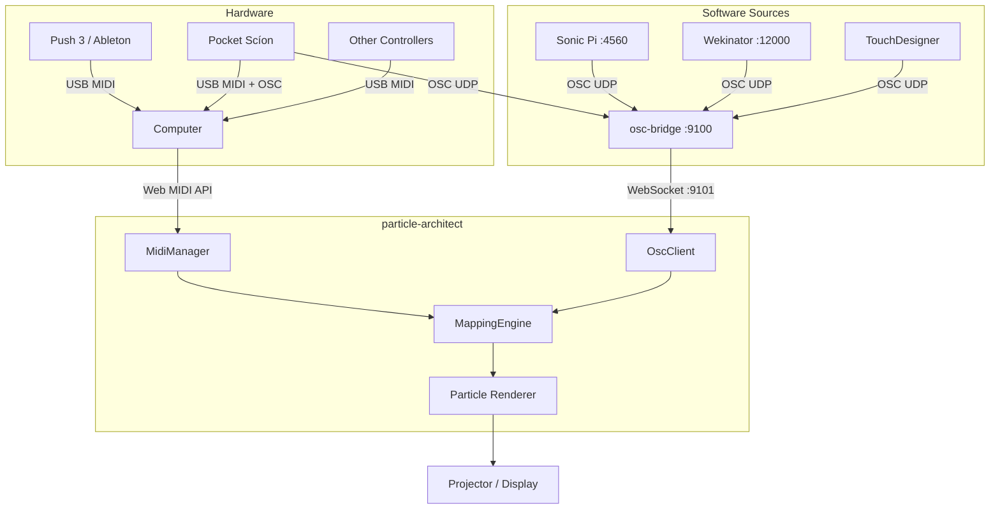

# Live Performance Guide

How to use particle-architect in a live AV performance stack alongside Ableton Live, Sonic Pi, TouchDesigner, Wekinator, and Pocket Scíon biofeedback.

## Quick Start

```bash
# 1. Start the OSC bridge
node src/osc/osc-bridge-server.js

# 2. Open particle-architect in Chrome
# (Web MIDI API requires Chrome or Edge)
npm run dev
# → http://localhost:3000

# 3. Enable MIDI/OSC
# Click the Radio (📻) icon in the toolbar, or:
# Settings → MIDI/OSC → toggle "MIDI/OSC Input"
```

## Signal Flow



## Port Map

Chosen to avoid conflicts with the existing AV stack:

| Tool | Receive Port | Send Port | Protocol |
|------|-------------|-----------|----------|
| Sonic Pi | 4560 | configurable | OSC/UDP |
| Wekinator | 6448 | 12000 | OSC/UDP |
| TouchDesigner | 10000 | configurable | OSC/UDP |
| nw_wrld | 9000 | configurable | OSC/MIDI |
| AbletonOSC | 11000 | 11001 | OSC/UDP |
| Pocket Scíon | N/A (sends) | app-configurable | OSC/USB-MIDI |
| **particle-architect bridge** | **9100 (UDP)** | **9101 (WS)** | **OSC→WS** |

All ports are configurable via CLI flags:
```bash
node src/osc/osc-bridge-server.js --udp-port 9100 --ws-port 9101
```

## Setup Guides

### Ableton Live + Push 3 → MIDI

1. Connect Push 3 via USB
2. Open particle-architect in Chrome
3. Enable MIDI in Settings → MIDI/OSC → Connection → MIDI toggle
4. Select "Ableton Push 3" from the device dropdown (or leave on "All devices")
5. Use Learn mode to map Push encoders to particle parameters:
   - Click a "Quick Learn" button next to any parameter
   - Turn the Push encoder you want to assign
   - Mapping is created automatically
6. Map suggested CCs:
   - CC 1 (Mod Wheel) → particle turbulence
   - CC 7 (Volume) → simulation speed
   - CC 71 (Filter) → bloom strength
   - Note velocity → color intensity burst

### Sonic Pi → OSC

In Sonic Pi, send OSC messages to the bridge:

```ruby
# In Sonic Pi
use_osc "localhost", 9100

live_loop :particles do
  # Drive particle speed with a sine LFO
  osc "/particle/param", "speed", (Math.sin(tick * 0.1) + 1) * 1.5

  # Trigger formation burst on beat
  osc "/particle/trigger", 1.0

  sleep 0.25
end

live_loop :biodata_viz do
  # Forward Pocket Scíon data to particles
  # (if Scíon is sending to Sonic Pi)
  delta = sync "/osc*/delta"
  osc "/delta", delta[0]
end
```

In particle-architect, create mappings:
- OSC `/particle/param` → speed (output 0.1-3.0)
- OSC `/particle/trigger` → formation burst
- OSC `/delta` → turbulence control

### Pocket Scíon → Biodata-Driven Particles

Pocket Scíon sends bioelectrical data as both MIDI and OSC:

**Via MIDI (USB):**
- Notes on channels 1-5 representing different biorhythms
- Map channel 1 velocity → particle scale
- Map channel 2 velocity → color hue shift

**Via OSC (desktop app):**
Configure Pocket Scíon desktop app to send to `localhost:9100`:

| OSC Address | Biodata Meaning | Suggested Mapping |
|-------------|----------------|-------------------|
| `/delta` | Rate of change | Particle turbulence / movement speed |
| `/variance` | Signal spread | Color hue range |
| `/deviation` | Standard deviation | Particle scatter radius |
| `/mean` | Average signal | Formation scale |
| `/min` | Signal minimum | Baseline threshold |
| `/max` | Signal maximum | Peak intensity |

Create a formation that responds to biodata:

```javascript
// Example: biodata-reactive formation
const turbulence = addControl("turbulence", "Turbulence", 0, 100, 20);
const hueRange = addControl("hueRange", "Hue Range", 0, 1, 0.3);
const scale = addControl("scale", "Scale", 0.1, 5, 1);

const angle = (i / count) * Math.PI * 2;
const radius = scale * (3 + Math.sin(time * 2 + i * 0.01) * (turbulence / 50));
const y = Math.sin(angle * 3 + time) * 2 * (turbulence / 50);

target.set(
  Math.cos(angle) * radius,
  y,
  Math.sin(angle) * radius
);

const hue = (i / count * hueRange + time * 0.1) % 1;
color.setHSL(hue, 0.8, 0.6);
```

Then map:
- OSC `/delta` → `turbulence` (output 0-100)
- OSC `/variance` → `hueRange` (output 0-1)
- OSC `/mean` → `scale` (output 0.1-5)

### Wekinator (ML) → OSC

Wekinator outputs on `/wek/outputs`:

1. Train Wekinator with gesture/sensor data → numeric outputs
2. Configure Wekinator to send to `localhost:9100`
3. Map in particle-architect:
   - OSC `/wek/outputs` arg[0] → formation scale
   - OSC `/wek/outputs` arg[1] → color shift
   - OSC `/wek/outputs` arg[2] → turbulence

### TouchDesigner → OSC

In TouchDesigner, use an OSC Out CHOP:

1. Set destination: `localhost`, port `9100`
2. Use address pattern `/td/particles/*`
3. Map channels:
   - `/td/particles/speed` → simulation speed
   - `/td/particles/bloom` → glow intensity
   - `/td/particles/scale` → formation scale

In particle-architect, use wildcard mapping:
- OSC `/td/particles/*` → matched by individual address mappings

## Fullscreen & Projection Mapping

### Fullscreen Mode
- Click the Fullscreen button in the toolbar (or press F11)
- The canvas fills the entire screen, sidebar and toolbar hide
- Perfect for projection mapping

### Multi-Display Setup
1. Extend your desktop to the projector/second display
2. Move the Chrome window to the projector display
3. Enter fullscreen mode
4. Control from your primary display via MIDI/OSC (no need to see the UI)

### Tips for Projection
- Set render style to **plasma** or **ink** for the most visual impact on dark surfaces
- Increase bloom strength (via MIDI CC mapping) for more glow
- Black background is default — perfect for projection mapping
- Use `autoSpin` = false and control rotation via MIDI for deliberate camera movement

## Latency Considerations

| Path | Expected Latency |
|------|-----------------|
| USB MIDI → Web MIDI API → render | < 5ms |
| OSC UDP → bridge → WebSocket → render | 5-15ms |
| MIDI over network (rtpMIDI) | 10-30ms |
| Full signal chain (Scíon → Sonic Pi → bridge → render) | 15-40ms |

**Tips for lowest latency:**
- Use USB MIDI when possible (lowest latency)
- Run the OSC bridge on the same machine as the browser
- Close other Chrome tabs to maximise render budget
- Use 20,000 particles (not 50,000) for smoother 60fps
- Prefer `spark` or `vector` render styles (simplest shaders)

## Recommended Performance Checklist

- [ ] Chrome/Edge browser (Web MIDI API required)
- [ ] OSC bridge running: `node src/osc/osc-bridge-server.js`
- [ ] MIDI devices connected and selected in Settings → MIDI/OSC
- [ ] Mappings configured and tested (use Monitor tab to verify signals)
- [ ] Formation loaded with `addControl()` parameters
- [ ] Fullscreen mode on projector display
- [ ] Particle count set appropriately (20k for smooth performance)
- [ ] Backup formation presets saved (use Library tab)

## Triggering Formation Changes

To switch formations during a performance:

**From Sonic Pi:**
```ruby
# Map a MIDI program change or OSC message to select presets
# In particle-architect: manually load formations before performance
# Use MIDI program change to trigger (map to a custom control that your
# formation code reads as a preset selector)

osc "/particle/trigger", 1.0  # burst effect
```

**From Ableton:**
- Assign MIDI notes to trigger formation switches via a custom control
- Use your formation code to read a "preset" control value and branch:

```javascript
const preset = addControl("preset", "Preset", 0, 4, 0);
const p = Math.floor(preset);

if (p === 0) {
  // Sphere formation
  const phi = Math.acos(1 - 2 * (i / count));
  const theta = Math.sqrt(count * Math.PI) * phi;
  target.set(Math.cos(theta) * Math.sin(phi) * 4, Math.cos(phi) * 4, Math.sin(theta) * Math.sin(phi) * 4);
} else if (p === 1) {
  // Helix formation
  const t = i / count * Math.PI * 8;
  target.set(Math.cos(t) * 3, (i / count - 0.5) * 8, Math.sin(t) * 3);
}
// ... more presets
```

Then map MIDI Program Change → `preset` (output 0-4).
