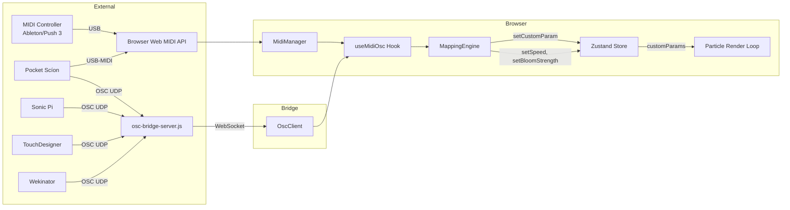

# MIDI/OSC Integration Design

## Architecture



## MIDI Input (Web MIDI API)

### MidiManager (`src/midi/MidiManager.ts`)

Singleton class wrapping the browser's Web MIDI API.

**Browser support:** Chrome 43+, Edge 79+, Opera 30+. Not supported in Firefox or Safari.

**API:**

```typescript
const midi = MidiManager.getInstance();

// Request access (shows browser permission prompt)
await midi.requestAccess();

// List devices
const devices = midi.getDevices();
// → [{ id, name, manufacturer, state }]

// Listen to a specific device or all
midi.selectDevice(deviceId);
midi.selectAll();

// Subscribe to events
const unsub = midi.onMessage((event: MidiEvent) => {
  // event.type: 'cc' | 'noteon' | 'noteoff' | 'pitchbend' | 'aftertouch' | 'channelpressure' | 'program'
  // event.channel: 1-16
  // event.number: 0-127 (CC number or note number)
  // event.value: 0-1 (normalised)
});
```

**Parsed message types:**

| MIDI Status | Type | Number | Value Range |
|------------|------|--------|-------------|
| 0x90 | `noteon` | Note (0-127) | Velocity 0-1 |
| 0x80 | `noteoff` | Note (0-127) | 0 |
| 0xB0 | `cc` | CC# (0-127) | 0-1 |
| 0xE0 | `pitchbend` | 0 | 0-1 (14-bit) |
| 0xA0 | `aftertouch` | Note (0-127) | Pressure 0-1 |
| 0xD0 | `channelpressure` | 0 | Pressure 0-1 |
| 0xC0 | `program` | Program# | 0-1 |

### Pocket Scíon MIDI

Pocket Scíon sends biodata as MIDI notes on channels 1-5. Map these using `noteon` type with the appropriate channel filter:

| Channel | Data | Suggested Target |
|---------|------|-----------------|
| 1 | Primary biorhythm | Formation morphing speed |
| 2 | Secondary rhythm | Color hue shift |
| 3 | Tertiary rhythm | Particle scale |
| 4 | Quaternary rhythm | Turbulence |
| 5 | Quinary rhythm | Bloom strength |

## OSC Input (via WebSocket Bridge)

### Bridge Server (`src/osc/osc-bridge-server.js`)

Browsers cannot receive UDP directly, so a lightweight Node.js bridge forwards OSC messages over WebSocket.

```bash
# Install dependencies (one time)
npm install osc ws

# Run the bridge
node src/osc/osc-bridge-server.js

# Custom ports
node src/osc/osc-bridge-server.js --udp-port 9100 --ws-port 9101
```

**Default ports:**
- UDP OSC receive: **9100**
- WebSocket serve: **9101**

The bridge:
1. Listens for OSC messages on UDP port
2. Parses messages and bundles
3. Converts to JSON: `{ address: "/delta", args: [0.75] }`
4. Broadcasts to all connected WebSocket clients

### OscClient (`src/osc/OscClient.ts`)

Singleton WebSocket client with auto-reconnect.

```typescript
const osc = OscClient.getInstance();

// Connect to bridge
osc.connect('ws://localhost:9101');

// Subscribe to events
const unsub = osc.onMessage((event: OscEvent) => {
  // event.address: "/delta"
  // event.args: [0.75, 1.2]
});

// Monitor connection state
osc.onStateChange((state) => {
  // 'disconnected' | 'connecting' | 'connected'
});
```

### OSC Address Table

| Source | Address | Args | Suggested Target |
|--------|---------|------|-----------------|
| Pocket Scíon | `/delta` | `[float]` | Particle speed / turbulence |
| Pocket Scíon | `/variance` | `[float]` | Color hue shift range |
| Pocket Scíon | `/deviation` | `[float]` | Particle scatter |
| Pocket Scíon | `/mean` | `[float]` | Formation scale |
| Pocket Scíon | `/min` | `[float]` | Min threshold |
| Pocket Scíon | `/max` | `[float]` | Max threshold |
| Wekinator | `/wek/outputs` | `[float...]` | Preset selector / multi-param |
| Sonic Pi | `/particle/trigger` | `[float]` | Burst / formation change |
| Sonic Pi | `/particle/param` | `[string, float]` | Named parameter control |
| TouchDesigner | `/td/particles/*` | `[float]` | Direct parameter control |

### Wildcard Address Matching

The mapping engine supports trailing wildcards:
- `/td/particles/*` matches `/td/particles/speed`, `/td/particles/scale`, etc.

## Mapping System

### MappingEngine (`src/mappings/MappingEngine.ts`)

The engine routes incoming events to particle parameters:

```typescript
interface Mapping {
  id: string;
  label: string;
  source: MidiSource | OscSource;
  targetType: 'customParam' | 'builtin';
  targetId: string;
  inputMin: number;      // Source range minimum
  inputMax: number;      // Source range maximum
  outputMin: number;     // Target range minimum
  outputMax: number;     // Target range maximum
  curve: 'linear' | 'exponential' | 'logarithmic';
  enabled: boolean;
}
```

**Scaling pipeline:**
1. Clamp input to `[inputMin, inputMax]`
2. Normalise to 0-1
3. Apply curve (linear/exponential/logarithmic)
4. Scale to `[outputMin, outputMax]`

**Built-in targets:**
- `speed` — simulation speed (0.1 - 3.0)
- `bloomStrength` — glow intensity (0.5 - 3.0)
- `autoSpin` — auto rotation (> 0.5 = on)

**Custom param targets:** Any `addControl()` parameter — the mapping calls `setCustomParam(id, value)` on the Zustand store, which the particle render loop reads on the next frame.

### MappingStore (`src/mappings/MappingStore.ts`)

Zustand store persisted to localStorage:

```typescript
{
  mappings: Mapping[],
  midiDeviceId: string | null,
  midiEnabled: boolean,
  oscWsUrl: string,          // default 'ws://localhost:9101'
  oscEnabled: boolean,
  oscConnected: boolean,
  midiConnected: boolean,
  learn: { active, targetType, targetId },
  midiLog: MidiEvent[],      // last 50 events
  oscLog: OscEvent[],        // last 50 events
}
```

### Learn Mode

1. User clicks "Learn" button next to a parameter (e.g. `scale` addControl)
2. Store enters learn state: `{ active: true, targetId: 'scale' }`
3. Next incoming MIDI or OSC event creates a new mapping automatically
4. The mapping source is extracted from the event (CC#, channel, OSC address)
5. Default output range is set to the parameter's range

## Integration with addControl()

The key architectural insight: **MIDI/OSC values feed into the same `setCustomParam()` mechanism that UI sliders use.** This means:

1. User loads a community formation that uses `addControl("turbulence", "Turbulence", 0, 100, 50)`
2. A slider appears in the Controls panel
3. User creates a MIDI mapping: CC 1 → `turbulence` (output 0-100)
4. Moving the mod wheel drives the turbulence parameter
5. The slider moves in sync, the particle function reads the updated value

No changes to existing formations are needed. Every formation with `addControl()` is automatically MIDI/OSC-controllable.

## UI

The MIDI/OSC panel is accessible via:
- **Settings → MIDI/OSC tab** (5th tab in settings modal)
- **Toolbar button** (Radio icon, toggles `midiOscEnabled`)

Three sub-tabs:
1. **Connection** — Enable/disable MIDI and OSC, device selection, WebSocket URL
2. **Mappings** — View/add/remove mappings, Learn mode, quick-learn buttons per control
3. **Monitor** — Live MIDI and OSC message log
